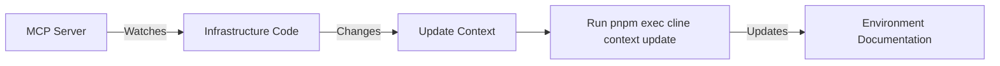

# AI Collaboration Framework

## Cline Integration

### Installation & Configuration

1. Install the [Cline VSCode Extension](https://marketplace.visualstudio.com/items?itemName=saoudrizwan.claude-dev)
2. Configure OpenRouter API key:

```bash
pnpm exec cline config set openrouter.key YOUR_API_KEY
```

3. Context storage location: `/home/sander/.vscode-server/data/User/globalStorage/saoudrizwan.claude-dev/context`

## Context Management

- **Global Context**: Root-level AI_CONTEXT.md
  - Architecture decisions
  - Cross-service contracts
  - Environment policies
- **Service Context**: Per-project AI_CONTEXT.md
  - Component boundaries
  - API specifications
  - Data flow diagrams

## Infrastructure Monitoring



## Collaboration Guidelines

1. Infrastructure changes require:

```bash
pnpm infra:docs && pnpm exec cline context update --scope infrastructure
```

2. Service updates must reference:
   - Related architecture decisions
   - Impacted data flows
   - Version compatibility matrix
