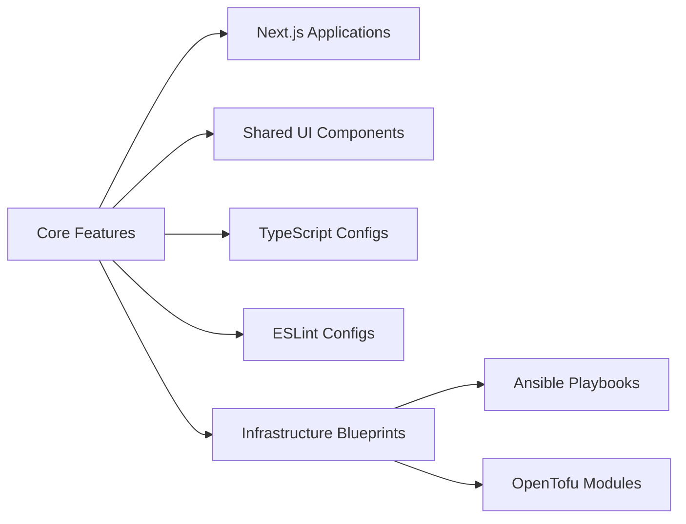
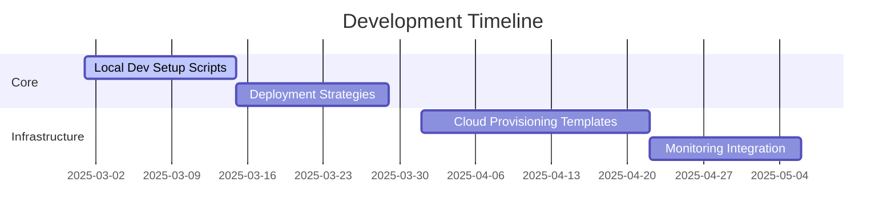

# Full-Stack DevOps Monorepo Platform 🚀

<div align="center">
  
  
  
  
  
</div>

## Vision Statement

A production-grade monorepo template for full-stack applications with built-in DevOps capabilities, combining:

- Modern web development (Next.js)
- Infrastructure-as-Code (OpenTofu/Ansible)
- Shared component library
- CI/CD pipelines
- Multi-environment management

## Current Capabilities ✅



**Implemented Features:**

- 🖥️ Two Next.js demo apps (web & docs)
- 🧩 Shared UI component library
- 🔧 Unified TypeScript/ESLint configurations
- 🏗 Basic Infrastructure-as-Code patterns
- ⚡ TurboRepo-optimized build pipelines

## Roadmap 🛣️



**Immediate Priorities:**

1. 🛠 **One-Click Local Setup**

   - Automated environment provisioning
   - Dependency management
   - Local service orchestration

2. 🚀 **Deployment Strategies**

   - Multi-cloud deployment guides
   - Blue/Green deployment patterns
   - Canary release configurations

3. 🔒 **Security Foundations**
   - Secret management integration
   - Infrastructure hardening scripts
   - Compliance as Code templates

## Project Structure

```bash
.
├── apps/
│   ├── web      # Next.js production application
│   └── docs     # Documentation & system overview
├── packages/
│   ├── ui       # Shared React components
│   ├── eslint-config  # Standardized lint rules
│   └── typescript-config # TS base configurations
├── infrastructure/
│   ├── ansible         # Configuration management
│   └── opentofu        # Cloud provisioning
└── turbo.json          # Build pipeline config
```

## Getting Started

```bash
# Clone & install
git clone https://github.com/your-org/devops-monorepo.git
cd devops-monorepo
pnpm install

# Start development servers
pnpm dev
```
