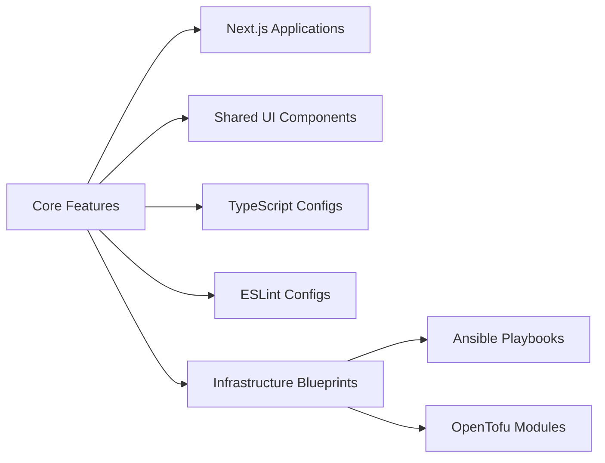
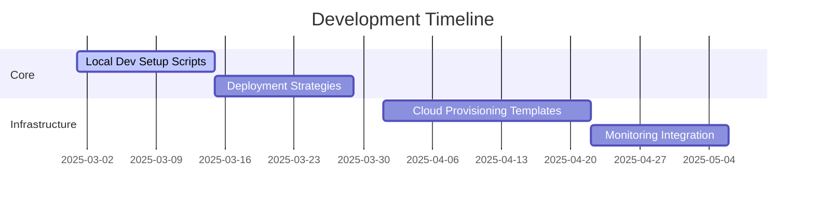

# Full-Stack DevOps Monorepo Platform 🚀

<div align="center">
  
  
  
  
  
</div>

## Vision Statement

A production-ready monorepo platform for multi-language/technology systems with integrated DevOps capabilities, featuring:

- Full-stack application development (Next.js + TypeScript)
- Infrastructure-as-Code (OpenTofu/Ansible)
- Cross-platform component libraries
- End-to-end CI/CD pipelines
- Multi-environment deployment strategies
- Integrated testing frameworks
- Secret management Vault

## Current Capabilities ✅



**Implemented Features:**

- 🖥️ Two Next.js demo apps (web & docs)
- 🧩 Shared UI component library
- 🔧 Unified TypeScript/ESLint configurations
- 🏗 Basic Infrastructure-as-Code patterns
- ⚡ TurboRepo-optimized build pipelines

## Roadmap 🛣️



**Immediate Priorities:**

1. 🛠 **One-Click Local Setup**

   - Automated environment provisioning
   - Dependency management
   - Local service orchestration

2. 🚀 **Deployment Strategies**

   - Multi-cloud deployment guides
   - Blue/Green deployment patterns
   - Canary release configurations

3. 🔒 **Security Foundations**
   - Self-hosted HashiCorp Vault integration
   - Infrastructure hardening scripts
   - Compliance as Code templates

## Project Structure

```bash
.
├── apps/
│   ├── web      # Next.js production application
│   └── docs     # Documentation & system overview
├── packages/
│   ├── ui       # Shared React components
│   ├── eslint-config  # Standardized lint rules
│   └── typescript-config # TS base configurations
├── infrastructure/
│   ├── ansible         # Configuration management
│   └── opentofu        # Cloud provisioning
├── .clinerules         # Repository-wide development standards
├── .clinerules-architect # Architecture-specific rules
├── AI_CONTEXT.md       # Infrastructure context
└── turbo.json          # Build pipeline config
```

### Preferred Way of Working

- **Branching:** For new features, create a branch from the main branch. Use atomic commits within these branches to document changes effectively.
- **Commits:** Ensure commits are small, focused, and descriptive to enhance the project's documentation through git history.

## AI Implementation

- **.clinerules:** Contains repository-wide development standards for code style, testing, documentation, and infrastructure practices. **Use this file to set standards that apply across all projects in the monorepo.**
- **.clinerules-architect:** Specifies architecture-specific rules for design principles, documentation standards, and decision records. **Use this file to define architecture patterns and practices for the architect mode.**
- **AI Context Files:** Use AI context files to provide additional context to AI tools. These files should be in the root of the project with additional files on a per-subproject basis in the respective directory. They can include:
  - Project-specific guidelines
  - Code snippets for reference
  - Architectural decisions
  - Any other relevant information for AI tools to understand the project better

**Usage:**

- **.clinerules:** Use this file to set standards that apply across all projects in the monorepo. **Ensure your code adheres to these standards for consistency and quality.**
- **.clinerules-architect:** Use this file to define architecture patterns and practices for the architect mode. **This helps maintain architectural integrity across the project.**
- **AI Context Files:** Use these files to provide context to AI tools. **Place them in the root of the project with additional files on a per-subproject basis in the respective directory.**

## Getting Started

```bash
# Clone & install
git clone  https://github.com/sanderkooger/Monorepo-AI-Powered.git
cd devops-monorepo
pnpm install

# Start development servers
pnpm dev
```
