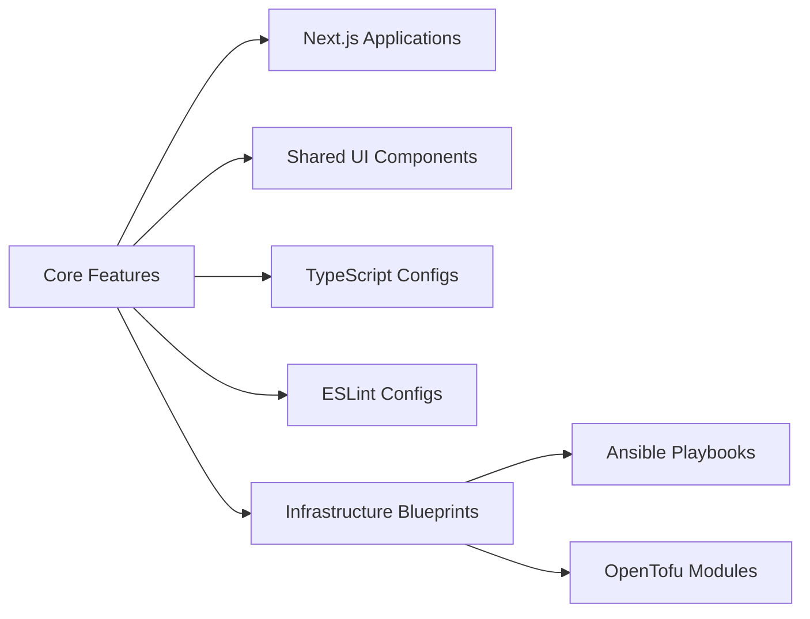
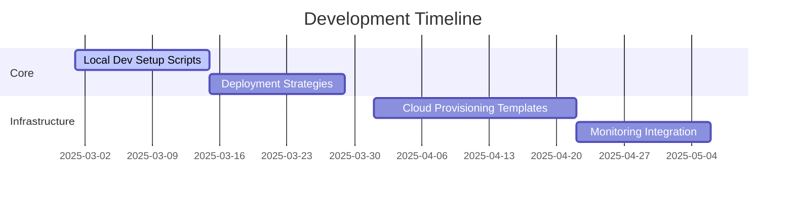

# Full-Stack DevOps Monorepo Platform 🚀

<div align="center">
  
  
  
  
  
  
  <br>
  
  
  
  
  
  
</div>

## Vision Statement

A production-ready monorepo platform for multi-language/technology systems with integrated DevOps capabilities, featuring:

- Full-stack application development (Next.js + TypeScript)
- Infrastructure-as-Code (OpenTofu/Ansible)
- Cross-platform component libraries
- End-to-end CI/CD pipelines
- Multi-environment deployment strategies
- Integrated testing frameworks
- Secret management Vault

## Current Capabilities ✅



**Implemented Features:**

- 🖥️ Two Next.js demo apps (web & docs)
- 🧩 Shared UI component library
- 🔧 Unified TypeScript/ESLint configurations
- 🏗 Basic Infrastructure-as-Code patterns
- ⚡ TurboRepo-optimized build pipelines

## Roadmap 🛣️



**Immediate Priorities:**

1. 🛠 **One-Click Local Setup**

   - Automated environment provisioning
   - Dependency management
   - Local service orchestration

2. 🚀 **Deployment Strategies**

   - Multi-cloud deployment guides
   - Blue/Green deployment patterns
   - Canary release configurations

3. 🔒 **Security Foundations**
   - Bring Your Own HashiCorp Vault implementation ([ADR](./docs/architecture/decisions/2025-04-20-bring-your-own-vault.md))
   - Infrastructure hardening scripts
   - Compliance as Code templates
   - Example Helm configuration for development:
     ```yaml
     # infrastructure/ansible/examples/vault-helm-values.yaml
     server:
       enabled: true
       ha:
         enabled: true
         replicas: 3
     global:
       tlsDisable: true # Enable TLS in production
     storage:
       file:
         path: "/vault/data"
     ```

## Project Structure

```bash
.
├── .roo/                   # Directory for AI-driven development standards
│   ├── rules/
│   │   └── .roorules.md    # Repository-wide development standards
│   └── rules-architect/
│       └── .roorules.md    # Architecture-specific rules
├── apps/                   # Application-specific code
│   ├── web                 # Next.js production application
│   └── docs                # Documentation & system overview
├── packages/               # Shared libraries and configurations
│   ├── ui                  # Shared React components
│   ├── eslint-config       # Standardized lint rules
│   └── typescript-config   # TS base configurations
├── infrastructure/         # Infrastructure as Code (IaC)
│   ├── ansible             # Configuration management
│   │   └── playbooks/
│   │       └── setup-local-dev.yml # Playbook for dev tool installation
│   ├── opentofu            # Cloud provisioning (see .roorules for standards)
│   └── packer              # VM Image building (e.g., Proxmox Ubuntu) -> [See Details](./infrastructure/packer/)
├── scripts/                # Utility and setup scripts
│   └── setup-dev-env.sh    # Script to bootstrap dev environment
└── turbo.json              # Build pipeline config
```

### Preferred Way of Working

- **Branching:** For new features, create a branch from the main branch. Use atomic commits within these branches to document changes effectively.
- **Commits:** Ensure commits are small, focused, and descriptive to enhance the project's documentation through git history.

## Development Standards & AI Guidance

This repository employs a hierarchical system of `.roorules.md` files to define development standards, best practices, and operational guidelines. These rules are utilized by AI development assistants (like Roo) to ensure consistency, quality, and adherence to architectural decisions across the monorepo.

### `.roorules.md` Hierarchy

The rules are organized as follows:

```mermaid
graph TD
    A[Monorepo Root] --> B[<code>.roo/</code> Directory]
    B --> C[<code>rules/.roorules.md</code><br>(Global Repository Standards)]
    B --> D[<code>rules-architect/.roorules.md</code><br>(Global Architect Role Standards)]
    B --> E[<code>rules-<other-role>/.roorules.md</code><br>(Future Role-Specific Standards)]
    A --> F[Specific Directory<br>(e.g., <code>infrastructure/opentofu/</code>)]
    F --> G[<code>.roorules</code> or <code>.roorules.md</code><br>(Directory-Specific Standards)]
```

*   **Global Repository Standards (`.roo/rules/.roorules.md`):**
    *   **Purpose:** Defines overarching standards applicable to the entire repository.
    *   **Current Scope:** Covers general code style (TypeScript, indentation, React, JSDoc), commit strategies, documentation practices (READMEs, ADRs, JSDocs), and recommended MCP (Model Context Protocol) tool usage.
*   **Role-Specific Global Standards (`.roo/rules-<role>/.roorules.md`):**
    *   **Purpose:** Provides specialized guidelines for different development roles.
    *   **Example (`.roo/rules-architect/.roorules.md`):** Defines architectural design principles (e.g., hexagonal architecture), documentation standards for architectural decisions (ADRs, secret management), and decision record formats.
*   **Directory-Specific Standards (`<directory>/.roorules.md` or `.roorules`):**
    *   **Purpose:** Allows for context-specific rules tailored to particular technologies, modules, or sub-projects. These rules complement or can override global rules for that specific context.
    *   **Example (`infrastructure/opentofu/.roorules`):** Details standards for OpenTofu structure, environment management, coding practices, change validation, and documentation.
    *   **Example (`infrastructure/packer/ubuntu/22.04/.roorules.md`):** Currently a placeholder, indicating Packer rules are for future reference.

**Usage:**

AI tools will reference these `.roorules.md` files to:
- Understand project standards and constraints.
- Generate code and configurations aligned with established practices.
- Assist in reviews and suggest improvements based on defined rules.
- Provide contextually relevant advice and solutions.

## Getting Started

```bash
# Clone & install
git clone  https://github.com/sanderkooger/Monorepo-AI-Powered.git
cd devops-monorepo
pnpm install

# Set up local development environment tools
# This script ensures required tools are installed via Ansible:
# - Ansible (installed by script if missing)
# - NVM (v0.39.7)
# - Node.js (Latest LTS via NVM)
# - Packer (v1.10.3)
# - OpenTofu (v1.7.2)
# It also enables Corepack to manage pnpm (using version from package.json).
# Note: The script may prompt for sudo password for installations.
pnpm dev-init

# Start development servers
pnpm dev
```
