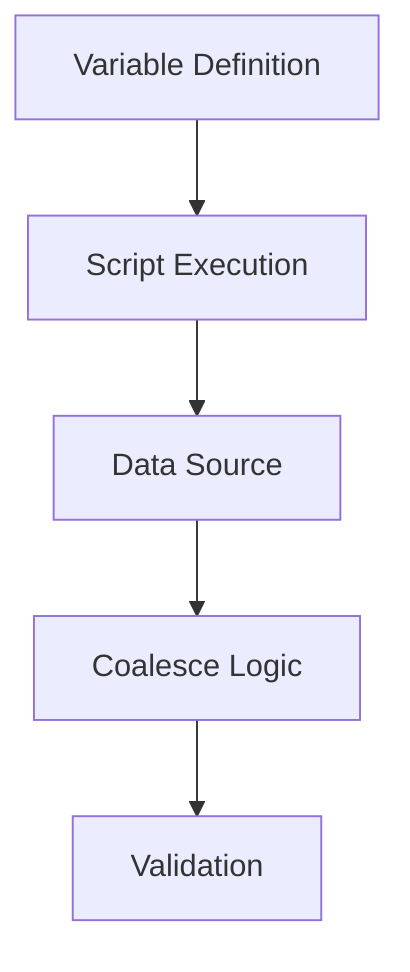

# ADR-20240502: Repository Name Variable Implementation

## Status
Proposed

## Context
Need to dynamically set `repo_name` variable with:
1. Default from git origin URL
2. Override capability via .auto.tfvars
3. Validation for required value

## Decision


### Components
1. **variables.tf**
```hcl
variable "repo_name" {
  type        = string
  description = "Repository name from git origin (format: org/repo)"
  default     = null
  validation {
    condition     = coalesce(var.repo_name, try(data.external.repo_name.result.repo_name, null)) != null
    error_message = "Repo name required: set via .auto.tfvars or ensure git origin exists"
  }
}
```

2. **get_repo_name.sh**
```sh
#!/bin/sh
git remote get-url origin | sed -E -e 's/.*github.com(:|\/)//' -e 's/\.git$//' -e 's/\/$//' -e 's/.*\///'
```

3. **Data Source**
```hcl
data "external" "repo_name" {
  program = ["sh", "${path.module}/scripts/get_repo_name.sh"]
}
```

4. **Usage**
```hcl
locals {
  final_repo_name = coalesce(var.repo_name, data.external.repo_name.result.repo_name)
}
```

## Consequences
- Requires git repository initialization
- Adds 1 external script dependency
- Maintains Terraform declarative patterns