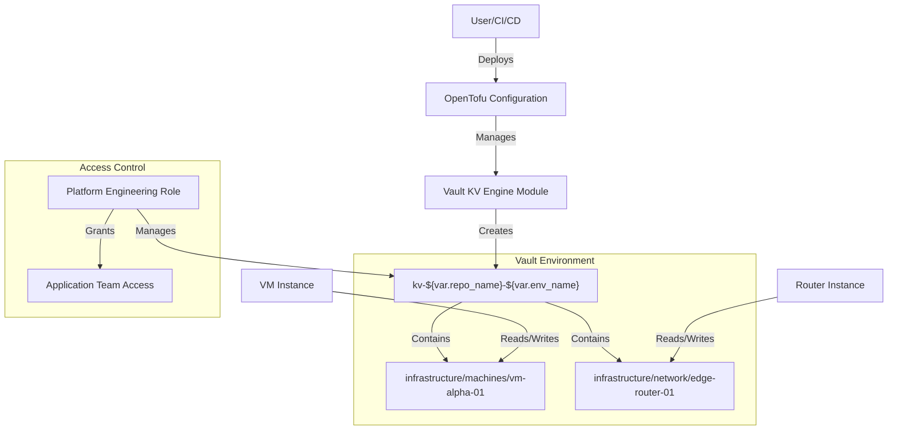

---

**ADR-2025-05-06-Vault-KV-Strategy: Standardized Vault KV Path and Policy Management for Modules**

*   **Status:** Accepted
*   **Deciders:** Roo (Technical Lead), Project Team
*   **Date:** 2025-05-06

**Context and Problem Statement:**

The project requires a simplified, secure, and scalable method for various infrastructure modules (managed by OpenTofu) to store and access secrets within HashiCorp Vault. Currently, there isn't a standardized approach, leading to potential inconsistencies, security risks, and difficulties in managing secret lifecycles, especially ensuring that the deletion of one module does not inadvertently affect secrets stored by others. The goal is to have a single, clearly named Key/Value (KV) secrets engine per environment, with modules claiming distinct, isolated paths within it.

**Decision Drivers:**

*   **Security:** Enforce least privilege for modules accessing secrets; ensure strong isolation between secrets of different modules.
*   **Simplicity:** Provide a straightforward and predictable way for module developers to integrate with Vault.
*   **Scalability:** Accommodate a growing number of modules and environments without undue complexity.
*   **Maintainability:** Establish clear conventions and leverage Infrastructure as Code (IaC) for managing Vault configurations.
*   **Data Integrity:** Prevent accidental data loss of one module's secrets when another module undergoes lifecycle changes (e.g., deletion).
*   **Reusability:** Allow the Vault configuration patterns to be easily adapted for different repositories and environments.

**Considered Options:**

1.  **Option 1 (Chosen): Centralized, Dynamically Named KV with Module-Specific Policies and Paths.**
    *   A single KV-v2 secrets engine is mounted per environment, named dynamically using repository and environment variables (e.g., `path = "kv-${var.repo_name}-${var.env_name}"`).
    *   A standardized hierarchical path structure is enforced within this mount: `kv-${var.repo_name}-${var.env_name}/<module_type>/<module_category>/<module_instance_name>/...` (e.g., `kv-myproject-prod/infrastructure/machines/webserver-01/config`).
    *   Centralized policy management through infrastructure team-controlled roles
    *   Module-specific path isolation using hierarchical structure
    *   Secrets retention policy aligned with environment lifecycle

2.  **Option 2: Separate KV Mount per Module.**
    *   Each module would define and manage its own `vault_mount`.
    *   *Pros:* Strongest possible isolation at the mount level.
    *   *Cons:* Increased Vault management overhead, potential for mount proliferation, more complex cross-module secret sharing if ever needed, less centralized view of secrets for an environment.

3.  **Option 3: Shared Policies with Granular Path Permissions in ACLs.**
    *   Fewer, more generic policies, with permissions granted to specific paths within the policy rules.
    *   *Pros:* Potentially fewer policy objects in Vault.
    *   *Cons:* More complex policy documents, harder to manage with IaC at the module level, increased risk if a shared policy is misconfigured or overly permissive, less clear audit trail for a module's specific access.

**Decision Outcome:**

**Chosen Option: Option 1 - Centralized, Dynamically Named KV with Module-Specific Policies and Paths.**

This approach provides the best balance of security (through strict, module-instance-specific policies), manageability (via IaC within each module), and operational clarity. The dynamic naming of the KV store using `var.repo_name` and `var.env_name` enhances its adaptability and reusability. It directly addresses the requirement that module deletion (which removes the policy and AppRole) revokes access but does not destroy other modules' data or its own data by default.

**Implementation Details (as per the agreed plan):**

*   The existing `infrastructure/opentofu/modules/vault/kv_engine/main.tf` will be updated to accept `repo_name` and `env_name` variables to set its `path`.
*   The `infrastructure/opentofu/modules/vault/kv_engine` module provides:
    *   Environment-specific KV store creation
    *   Standardized path structure enforcement
    *   Integration with centralized access control policies
*   Secret access management handled through platform-level roles
*   Data retention policies managed through Vault's expiration system

**Positive Consequences:**

*   Clear, predictable, and environment-specific secret paths.
*   Strong RBAC-based isolation between module secrets.
*   Simplified secret management integration for module developers.
*   Fully automated policy and auth role provisioning/deprovisioning via IaC.
*   Reduced risk of accidental data deletion across modules.
*   Enhanced reusability of Vault configuration patterns.

**Negative Consequences:**

*   The OpenTofu Vault provider will require permissions to manage `vault_policy` and `vault_approle_auth_backend_role` resources.
*   Secure distribution and management of AppRole SecretIDs to client applications/modules is an operational responsibility (standard for AppRole).

**Linkages:**

*   Updates `infrastructure/opentofu/modules/vault/kv_engine/main.tf`.
*   Impacts all OpenTofu modules that will consume secrets from Vault.
*   Aligns with `docs/architecture/decisions/20240502-repo-name-variable.md` by promoting the use of `repo_name`.

---