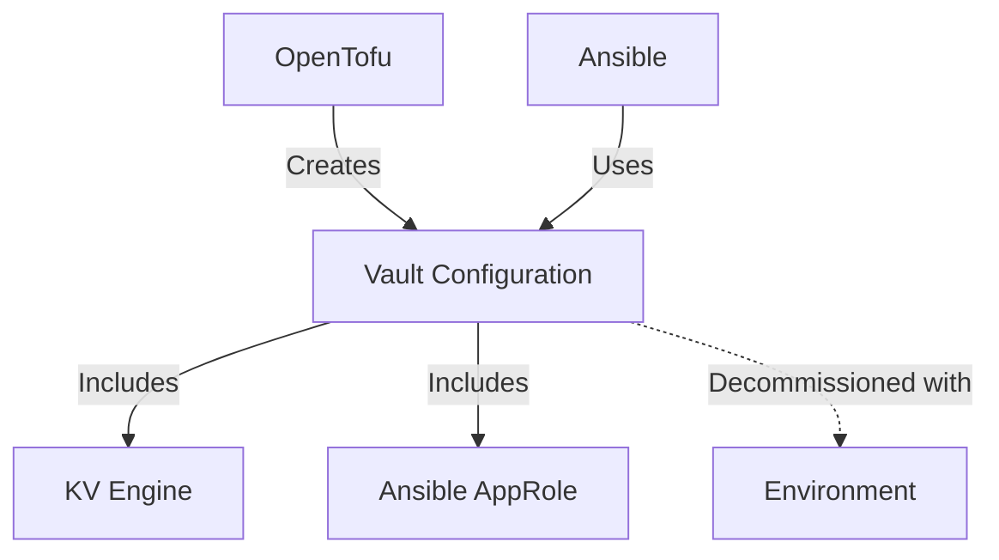

---
**ADR-2025-05-09-Secret-Management: Unified Vault Strategy for Infrastructure and Ansible**
* **Status:** Proposed  
* **Deciders:** Infrastructure Team, Security Team  
* **Date:** 2025-05-09  

**Context and Problem Statement:**  
Our infrastructure requires a unified approach to secret management that serves both Terraform/OpenTofu modules and Ansible automation while maintaining:
- Consistent naming conventions across environments and repositories
- Least privilege access controls
- Automated lifecycle management
- Clear separation of concerns between infrastructure components

**Decision Drivers:**  
- Security: Zero standing privileges for automated systems  
- Consistency: Predictable paths/policies across environments  
- Maintainability: Single source of truth for secret management  
- Automation: Full IaC integration with OpenTofu and Ansible  

**Implementation Strategy:**  

1. **Core Vault Configuration**  
```hcl
# infrastructure/opentofu/modules/vault/kv_engine/main.tf
resource "vault_mount" "kv" {
  path = "kv-${var.repo_name}-${var.env_name}"
  type = "kv-v2"
}

# Standardized Path Structure
path "kv-${repo_name}-${env_name}/infrastructure/*" {
  capabilities = ["create", "read", "update", "delete", "list"]
}

path "kv-${repo_name}-${env_name}/ansible/*" {
  capabilities = ["read", "list"]
}
```

2. **Ansible Integration**  
```hcl
resource "vault_approle_auth_backend_role" "ansible" {
  role_name = "ansible-${var.repo_name}-${var.env_name}"
  token_policies = ["service-${var.repo_name}-${var.env_name}"]
}

resource "vault_policy" "ansible" {
  name = "service-${var.repo_name}-${var.env_name}"
  policy = <<EOT
path "kv-${var.repo_name}-${var.env_name}/ansible/*" {
  capabilities = ["read", "list"]
}
EOT
}
```

3. **Lifecycle Management**  


**Consequences:**  
- **Positive:** Unified secret management reduces cognitive load and misconfiguration risks  
- **Negative:** Requires coordinated updates between infrastructure and Ansible teams  

**References:**  
- Supersedes ADR-2025-05-06-Vault-KV-Strategy  
- Replaces ADR-2025-05-08-Ansible-Strategy  
---