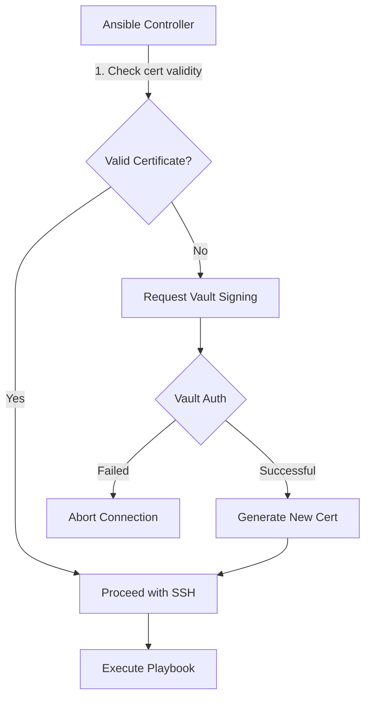

# Vault SSH Signer Connection Plugin



## Overview
Automates Vault-signed SSH certificate management for Ansible connections, enforcing short-lived credentials and PKI-based authentication.

## Configuration
```yaml
# inventory.yml
vault_ssh_ca_signing_role: "ssh-engine/roles/default-role"
vault_ssh_ca_principal: "ansible"
vault_ssh_key_min_ttl_seconds: 3600  # 1 hour minimum validity
```

## Example Playbook
```yaml
- name: Configure production servers
  hosts: prod
  connection: vault_ssh_signer
  vars:
    ansible_user: ansible  # Dedicated service account
  tasks:
    - name: Ensure security updates
      ansible.builtin.apt:
        update_cache: yes
        upgrade: dist-upgrade
```

## Security Architecture
- Aligns with [ADR-20250509](docs/architecture/decisions/20250509-secret-management.md)
- Certificates contain principal-based restrictions from Vault role
- Requires Vault token with limited `create` capability on `ssh-engine/sign/`

## Troubleshooting
```bash
# Check certificate validity manually
ssh-keygen -L -f ~/.ssh/id_rsa-cert.pub