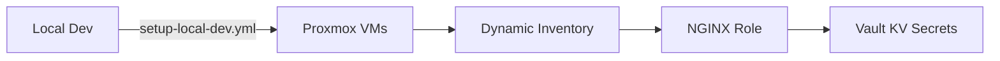

# Ansible Infrastructure Automation

## Overview
Modular Ansible configuration for provisioning:
- NGINX web servers with role-based configuration
- HashiCorp Vault integration for secret management



## Prerequisites
- Python 3.12.3 with virtualenv
- Ansible 8.5+
- Proxmox API access
- Vault token with write access to KV engine

## Virtual Environment Setup
```bash
# Create and activate venv
python3 -m venv .venv
source .venv/bin/activate
```

## Key Components


### Vault Integration
**Secret Path Structure**:
```bash
kv-${repo_name}-${env_name}/ansible/{collection}
# Example: kv-monorepo-prod/ansible/database_creds
```

**Configuration**:
1. Source from OpenTofu outputs:
```yaml
# ansible.cfg
[vault]
address = "{{ vault_addr }}"
role_id = "{{ vault_approle_id }}"
secret_id = "{{ vault_secret_id }}"
```

2. Secret retrieval example:
```yaml
- name: Get database credentials
  ansible.builtin.uri:
    url: "{{ vault_addr }}/v1/kv/data/ansible/database_creds"
    method: GET
    headers:
      X-Vault-Token: "{{ vault_token }}"
  register: secret_result
```

**Policy Requirements**:
- AppRole: `ansible-${repo_name}-${env_name}`
- Policy: `service-${repo_name}-${env_name}`

### Playbook Structure
Entrypoint for local provisioning:
```yaml
# setup-local-dev.yml
- hosts: localhost
  roles:
    - nginx
```

## Troubleshooting
| Issue | Solution |
|-------|----------|
| Inventory connection failed | Verify Proxmox API credentials in `ansible.cfg` |
| Vault permission denied | Renew token with `kv-secrets/write` policy |

## Architectural Decisions
- [20250509-secret-management.md](../docs/architecture/decisions/20250509-secret-management.md) (Unified Vault strategy)