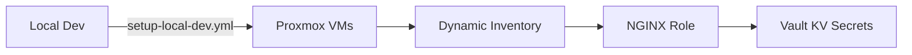

n 
# Ansible Infrastructure Automation

## Overview
Modular Ansible configuration for provisioning:
- Proxmox VMs via dynamic inventory
- NGINX web servers with role-based configuration
- HashiCorp Vault integration for secret management



## Prerequisites
- Python 3.12.3 with virtualenv
- Ansible 8.5+
- Proxmox API access
- Vault token with write access to KV engine

## Virtual Environment Setup
```bash
# Create and activate venv
python3 -m venv .ansible-venv
source .ansible-venv/bin/activate

# Install requirements
pip install -r inventory/requirements.txt
```

## Key Components

### Dynamic Inventory
Uses `dynamic_inventory.py` with Proxmox plugin:
```yaml
# ansible.cfg
[defaults]
inventory = ./inventory/dynamic_inventory.py
```

### Vault Integration
Reference KV engine setup from:
```bash
infrastructure/opentofu/modules/vault/kv_engine/
```

Example secret retrieval:
```yaml
- name: Get database credentials
  ansible.builtin.uri:
    url: "{{ vault_addr }}/v1/kv/data/db"
    method: GET
    headers:
      X-Vault-Token: "{{ vault_token }}"
```

### Playbook Structure
Entrypoint for local provisioning:
```yaml
# setup-local-dev.yml
- hosts: localhost
  roles:
    - nginx
```

## Troubleshooting
| Issue | Solution |
|-------|----------|
| Inventory connection failed | Verify Proxmox API credentials in `ansible.cfg` |
| Vault permission denied | Renew token with `kv-secrets/write` policy |
| Python module missing | Reinstall requirements from `inventory/requirements.txt` |

## Architectural Decisions
- [20250508-ansible-strategy.md](../docs/architecture/decisions/20250508-ansible-strategy.md)
- [20250506-vault-kv-strategy.md](../docs/architecture/decisions/20250506-vault-kv-strategy.md)