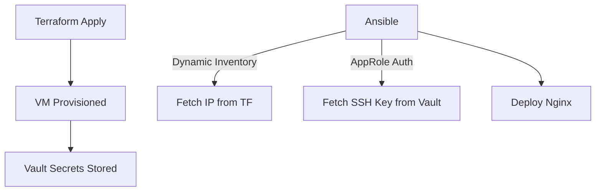

# Ansible Infrastructure Plan

## 1. Terraform Adjustments
- **File:** `infrastructure/opentofu/modules/compute/proxmox/ubuntu-vm/outputs.tf`
- **Action:** Add VM IP address output
```terraform
output "vm_ip_address" {
  description = "The IP address of the provisioned VM"
  value       = var.ip_address
}
```

## 2. Vault Configuration
### AppRole & Policy Creation
```terraform
# Added to Vault provider configuration
resource "vault_policy" "ansible_controller" {
  name = "ansible-controller-policy"
  policy = <<EOT
  path "kv-root/data/ssh_keys/bootstrap_user" {
    capabilities = ["read"]
  }
  path "kv-root/data/infrastructure/machines/*" {
    capabilities = ["read"]
  }
  EOT
}

resource "vault_approle_auth_backend_role" "ansible_controller" {
  backend        = "approle"
  role_name      = "ansible-controller-role"
  token_policies = [vault_policy.ansible_controller.name]
  secret_id_ttl  = "86400"
  token_ttl      = "3600"
}

resource "vault_approle_auth_backend_role_secret_id" "ansible_controller" {
  backend   = "approle"
  role_name = vault_approle_auth_backend_role.ansible_controller.role_name
}

output "ansible_role_id" {
  value = vault_approle_auth_backend_role.ansible_controller.role_id
}

output "ansible_secret_id" {
  value     = vault_approle_auth_backend_role_secret_id.ansible_controller.secret_id
  sensitive = true
}
```

## 3. Ansible Structure
```
infrastructure/ansible/
├── ansible.cfg
├── inventory/
│   └── group_vars/all/vault.yml
├── roles/
│   └── nginx/{tasks,handlers,templates}
└── playbooks/provision_vm.yml
```

## 4. Execution Flow


## 5. Future Scaling
- Kubernetes roles
- Secret rotation automation
- Multi-environment support