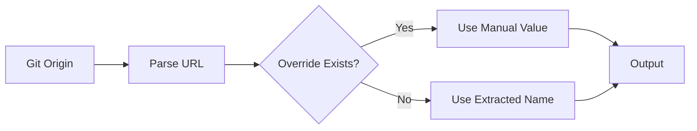

# Repository Name Module

## Purpose
This module automatically detects the repository name from git origin or accepts manual override. Designed for Terraform configurations requiring repository context.

## Features


## Inputs
| Name | Description | Type | Default |
|------|-------------|------|---------|
| repo_name | Manual repository name override | `string` | `null` |

## Outputs
| Name | Description |
|------|-------------|
| name | Final repository name after coalescing |

## Usage
```hcl
module "repo_name" {
  source = "./modules/helpers/repo_name"
  repo_name = "custom-repo-name" # Optional override
}
```

## Behavior
1. Extracts repository name from git origin URL
2. Supports both HTTPS and SSH URL formats
3. Validates presence of either source
4. Returns clean repository name without organization

## Troubleshooting
- **Error: Repo name required** - Ensure git origin is set or provide override
- **Invalid JSON output** - Verify script outputs valid JSON format